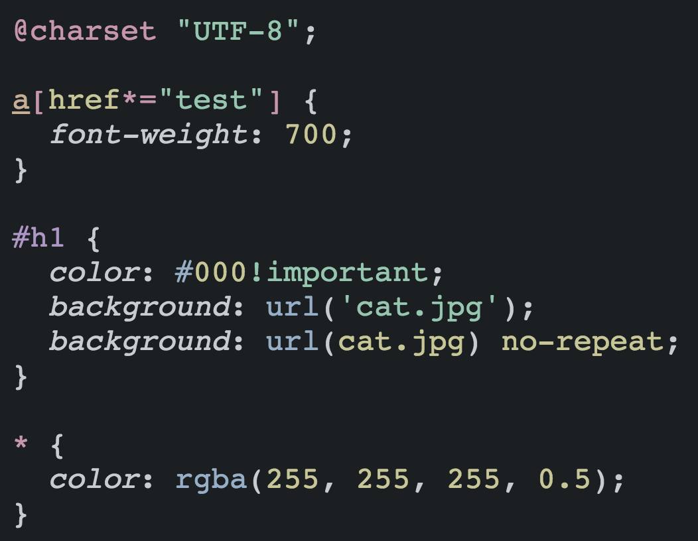

# midas [][ci] [][npm] [][deps]

> Syntax highlighter based on PostCSS.

midas generates a highly customisable base for syntax highlighting in HTML.
Simply pass in a CSS string and it will generate a HTML output. You can then
pair it with any of the included themes, or just as easily write your own.



## Install

With [npm](https://npmjs.org/package/midas) do:

```
npm install midas --save
```

## Example

```js
var midas = require('midas');

var result = midas('h1{}').content;
console.log(result);
```

This will output (indentation added for readability):

```html
<pre class="midas">
    <code>
        <span class="midas__selector">
            <span class="midas__tag">h1</span>
        </span>

        <span class="midas__brace">{</span>
        <span class="midas__brace">}</span>
    </code>
</pre>
```

midas ships with 94 different [Base 16 themes][base16] (47 palettes each with
light & dark variants) which are used to style this HTML.

## API

### midas(css)

midas exposes a PostCSS processor instance. This means that you can use it
both asynchronously:

```js
var midas = require('midas');

midas('h1{}').then(function (result) {
    console.log(result.content); // HTML output
});
```

Or you can use the synchronous API:

```js
var midas = require('midas');

var result = midas('h1{}').content;
console.log(result); // HTML output
```

#### css

Type: `string`
*Required option.*

Pass a CSS string to highlight.

### CLI

midas also ships with a CLI app. To see the available options, just run:

```sh
$ midas --help
```

## Contributing

Pull requests are welcome. If you add functionality, then please add unit tests
to cover it.

## License

Base 16 themes used by this module are MIT © 2012 [Chris Kempson][ck]
& contributors.

MIT © [Ben Briggs](http://beneb.info)

[base16]:  https://github.com/chriskempson/base16
[ck]:      http://chriskempson.com/
[ci]:      https://travis-ci.org/ben-eb/midas
[deps]:    https://gemnasium.com/ben-eb/midas
[npm]:     http://badge.fury.io/js/midas
